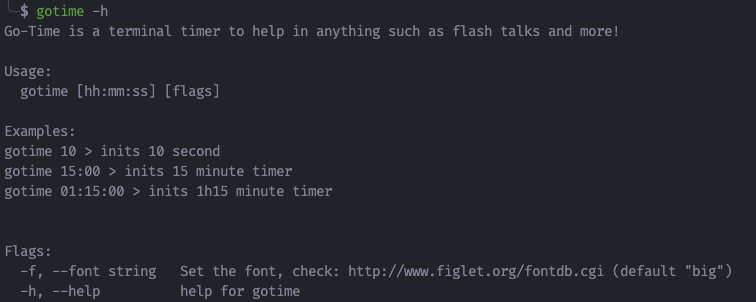

[](./LICENSE)
[](https://github.com/LombardiDaniel/go-time/actions)

# go-time

You either `got time` or it's `go time!`

Terminal timer for flash talks written in Go

## Installation

Just run in docker!

```sh
docker run lombardi/go-time:latest 05:00 # for 5 mins
```

or...

```sh
git clone https://github.com/LombardiDaniel/go-time
cd go-time
sudo make install
```

## Usage

```
gotime -h
```



Check out available fonts at http://www.figlet.org/fontdb.cgi
(checkout font `doh`) !

To use multiple other fonts just:

```sh
gotime 05:00 --font doom
```
